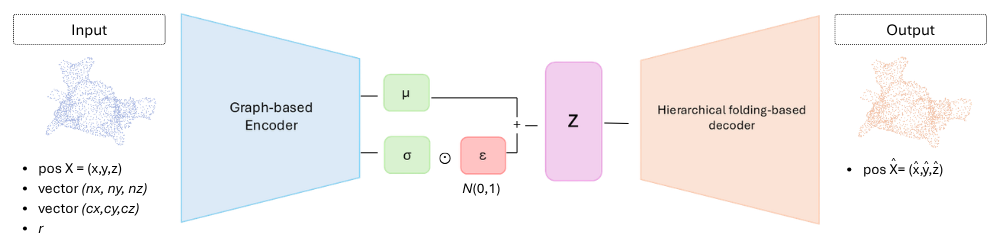

# AtrialMorphNet 🫀
AtrialMorphNet is a β-VAE for the representation of 3D
left atrial point cloud The architecture combines a graph-based encoder with PointNet-based layers, dynamic edge convolution, and a hierarchical folding-based decoder that reconstructs the final anatomical point cloud.

